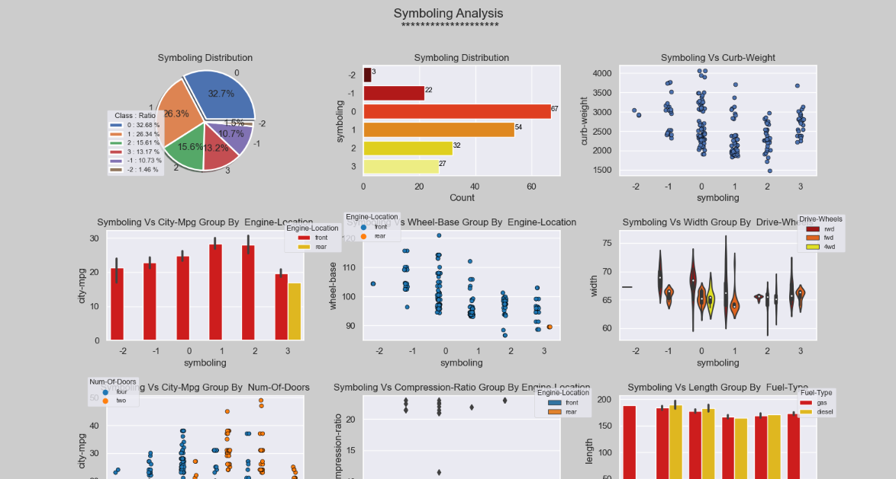

# auto-analysis
# 📊 Auto Data Analysis Web App

A Flask-based web application that automates data analysis by preprocessing datasets, detecting column types, handling missing values, generating summary statistics, and creating insightful visualizations.




## 📚 Table of Contents

- [Overview](#overview)
- [Features](#features)
- [Project Structure](#project-structure)
- [Requirements](#requirements)
- [How to Run](#how-to-run)
- [Usage](#usage)
---

# Overview

This web app allows users to:
- Upload their own `.csv` dataset.
- Choose from built-in Seaborn datasets.
- Automatically clean and analyze the data.
- View auto-generated plots and statistics per column.
- See results in an interactive HTML interface powered by Flask.

The backend handles preprocessing, visualization, and plotting logic using Pandas, NumPy, Matplotlib, and Seaborn.

---

# Features

- 📁 **Upload CSV File**: Analyze your own dataset.
- 📦 **Built-In Datasets**: Use any of 10+ Seaborn datasets like `titanic`, `tips`, `iris`, etc.
- 🧹 **Automatic Preprocessing**:
  - Handle ID columns
  - Drop highly null columns (>50% missing)
  - Fill missing values (mean, mode)
  - Convert object-like numeric columns to proper types
- 🗂️ **Column Type Detection**:
  - Categorical
  - Continuous
  - High-cardinality or skipped columns
- 📈 **Auto-Generated Visualizations**:
  - Histograms, Box Plots, Scatter Plots, Violin Plots, Count Plots, Pie Charts, Heatmaps
- 📊 **Interactive Results Page** with:
  - First 5 rows of dataset
  - DataFrame info (`df.info`)
  - Descriptive statistics
  - Combined plots per column
  - List of skipped high-cardinality columns

---

# Project Structure
```
    /auto-analysis-web-app/
    │
    ├── main.py # Flask app entry point
    ├── autoAnalysis.py # Core preprocessing & analysis functions
    ├── all_plots.py # Plotting logic for visualizations
    ├── requirements.txt # Python dependencies
    ├── templates/
    │ ├── home.html # Homepage with dataset selector
    │ └── result.html # Display page for analysis results
```

---

# Requirements

Install dependencies using:

```bash
    pip install -r requirements.txt
```

# How to Run
```
  1. git clone https://github.com/Abdallah-Ali247/auto-analysis.git 
  2. cd auto-analysis
  3. python main.py
```
# Usage

1. On the homepage:
  * Select a built-in dataset from the dropdown.
  * Or upload your own .csv file.
2. Click on Analyze .
3. Wait a moment while the app processes the data and generates insights.
4. View the results on the next page, including:
  * Dataset preview
  * Summary statistics
  * Auto-generated plots per column
  * Skipped high-cardinality columns
